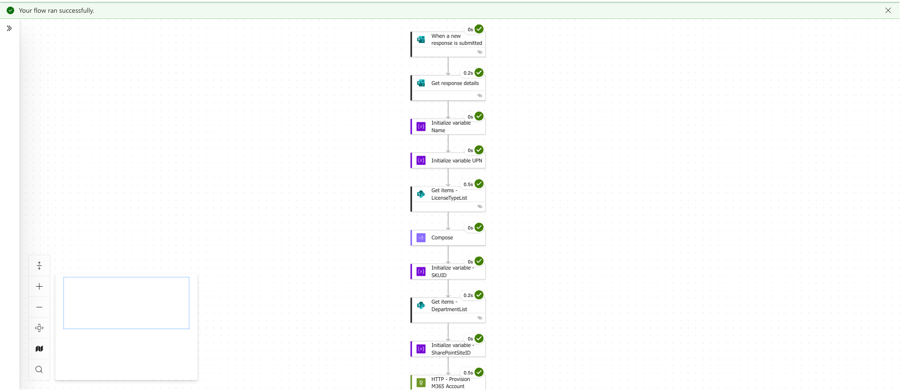
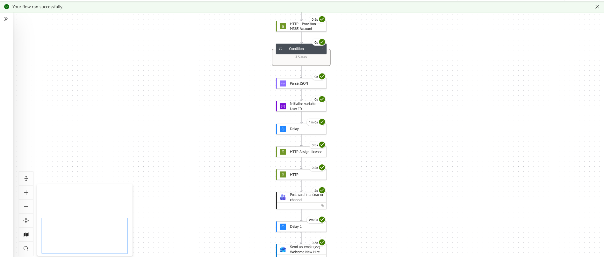
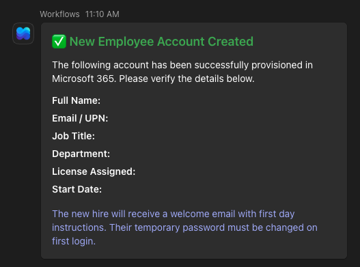

# Automated Employee Onboarding — M365 Account Provisioning (Power Automate)

## Overview

This Power Automate flow automates the entire Microsoft 365 account provisioning process for new employees. When HR submits an onboarding form, the flow creates the user's M365 account, assigns the appropriate license, adds them to the correct Teams and SharePoint groups, notifies their manager via Adaptive Card, sends a welcome email, and logs the event to a SharePoint audit list — all without any manual IT intervention.

---

## Use Case

Manual onboarding processes are slow, inconsistent, and easy to get wrong. In organizations where IT provisioning is handled separately from HR, new hires often start without the access they need. This flow eliminates that gap by triggering account provisioning the moment HR submits the onboarding request, ensuring every new hire is set up correctly and consistently from day one.

---

## Flow Summary

| Step | Action |
|------|--------|
| 1 | HR submits Microsoft Form with new hire details |
| 2 | Initialize variables (Display Name, UPN, User ID, SKU ID, Group IDs) |
| 3 | SharePoint lookup — License Mapping list returns SKU ID based on license type |
| 4 | SharePoint lookup — Department Routing list returns Teams and SharePoint Group IDs |
| 5 | Validate both lookups returned results — alert IT and terminate if not |
| 6 | Create M365 account via Microsoft Graph API |
| 7 | Delay 30 seconds for account propagation |
| 8 | Assign license via Microsoft Graph API |
| 9 | Add user to Teams group via Microsoft Graph API |
| 10 | Add user to SharePoint group via Microsoft Graph API |
| 11 | Post Adaptive Card to manager in Teams |
| 12 | Send welcome email to new hire |
| 13 | Log run to SharePoint audit list |

---

## Key Design Decisions

### Graph API over built-in connectors
The flow calls the Microsoft Graph API directly via HTTP actions rather than relying on built-in Power Automate connectors. This gives full control over the provisioning process and mirrors how enterprise solutions are actually built.

### SharePoint lookup tables over hardcoded values
Instead of using Switch actions with hardcoded department and license values, all routing logic lives in two SharePoint lists. Adding a new department or license type requires no changes to the flow — just a new row in the list.

**License Mapping List:**
| Column | Purpose |
|--------|---------|
| Title | License display name (matches form dropdown) |
| SKUID | Microsoft 365 license SKU ID |
| SKUPartNumber | License part number for reference |

**Department Routing List:**
| Column | Purpose |
|--------|---------|
| Title | Department name (matches form dropdown) |
| SharepointID | Microsoft 365 Group ID for SharePoint site |
| TeamsGroupID | Microsoft 365 Group ID for Teams team |

---

## Dynamic Expressions Used

| Expression | Purpose |
|------------|---------|
| `first(body('Get_items_-_LicenseTypeList')?['value'])?['SKUID']` | Returns SKU ID from License Mapping list |
| `first(body('Get_items_-_DepartmentList')?['value'])?['SharepointID']` | Returns SharePoint Group ID from Department Routing list |
| `json(concat('{"@odata.id": "https://graph.microsoft.com/v1.0/directoryObjects/', variables('varUserID'), '"}'))` | Builds Graph API body for group membership — required due to Power Automate misinterpreting `@odata.id` as an expression |
| `utcNow()` | Timestamp for audit log entry |

---

## Common Errors & Fixes

**Error:** `The input parameter(s) of operation contains invalid expression(s)`

**Cause:** When building HTTP action bodies that contain keys starting with `@` (such as `@odata.id` in Graph API calls), Power Automate's expression parser misinterprets them as expressions, causing a validation error before the flow even runs.

**Fix:** Build the body using `json(concat(...))` instead of raw JSON with embedded dynamic tokens:
```
json(concat('{"@odata.id": "https://graph.microsoft.com/v1.0/directoryObjects/', variables('varUserID'), '"}'))
```

---


**Error:** License or group assignment fails immediately after account creation

**Cause:** Microsoft 365 needs time to fully propagate a newly created account before it can receive a license or group membership.

**Fix:** Add a **30 second Delay** action between account creation and all subsequent Graph API calls.

---

## Security Considerations

- Azure App Registration scoped to minimum required permissions (`User.ReadWrite.All`, `Group.ReadWrite.All`)
- Client secret should be stored in **Azure Key Vault** for production deployments rather than directly in the flow
- Microsoft Form restricted to internal organization users only
- Full audit trail maintained in SharePoint for every provisioning event
- New hire temporary passwords set to force change on first login (`forceChangePasswordNextSignIn: true`)

---

## Notes

- This flow was built and tested using **Microsoft Graph API v1.0**
- SharePoint Lists are used as the data source for lookup tables. In an enterprise environment, **Dataverse** would be the recommended data source for greater scalability and role-based access control
- To find your license SKU IDs, run a `GET https://graph.microsoft.com/v1.0/subscribedSkus` call and match the `skuPartNumber` to the license name
- To preview and test Adaptive Card layouts before deploying, use the [Adaptive Cards Designer](https://adaptivecards.io/designer/) — replace Power Automate dynamic expressions (`@{...}`) with static values for the designer to render correctly

---

## Technologies Used

- Microsoft Power Automate
- Microsoft Graph API (v1.0)
- Microsoft Forms
- SharePoint Online
- Microsoft Teams (Adaptive Card notification)
- Outlook / Exchange Online
- Azure Active Directory (App Registration)
- Adaptive Cards v1.4
- Microsoft 365

---

## Screenshots
### Power Automate Flow
<br>


### Manager Adaptive Card (Teams)

