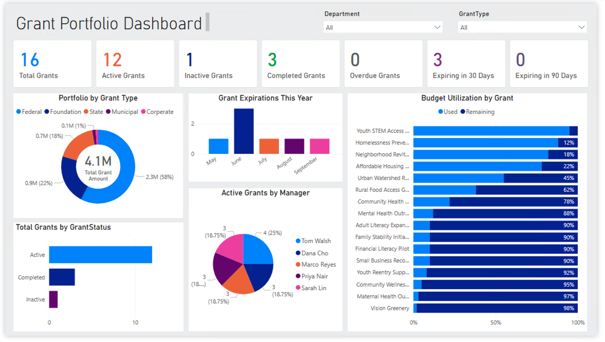
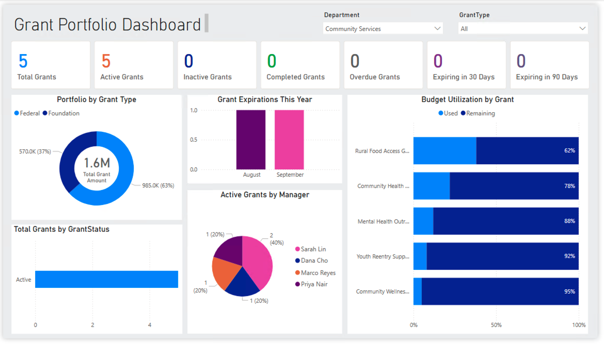

# 📊 Grant Portfolio Dashboard

A Power BI dashboard designed to provide grants managers and organizational leadership with a real-time view of grant portfolio health, budget utilization, and expiration timelines.

---

## 📋 Overview

Managing a grant portfolio requires tracking multiple moving parts — award amounts, reporting deadlines, budget burn rates, and expiration dates — across multiple funders, managers, and programs. This dashboard consolidates all of that into a single, interactive view.

Built in **Power BI Desktop**, connected to an **Sharepoint List** for automatic data refresh.

---

## 🖥️ Dashboard Visuals

| Visual | Description |
|---|---|
| **Total Grants** | Count of all grants in the portfolio |
| **Active Grants** | Count of currently active grants |
| **Inactive Grants** | Count of inactive grants |
| **Completed Grants** | Count of closed/completed grants |
| **Overdue Grants** | Grants past their end date still marked Active |
| **Expiring in 30 Days** | Active grants ending within 30 days |
| **Expiring in 90 Days** | Active grants ending within 90 days |
| **Portfolio by Grant Type** | Donut chart showing award value distribution across Federal, Foundation, State, Municipal, and Corporate grants |
| **Grant Expirations This Year** | Column chart showing count of grants ending by month for the current year |
| **Grants by Status** | Horizontal bar chart showing portfolio breakdown by Active, Completed, and Inactive |
| **Active Grants by Manager** | Pie chart showing grant ownership distribution across grant managers |
| **Budget Utilization by Grant** | 100% stacked bar chart showing budget used vs. remaining per grant |

---

## 🗂️ Data Model

The dashboard is powered by a single Sharepoint List

### Grants Table
| Column | Description |
|---|---|
| Grant Code | Unique identifier e.g. GR-2024-001 |
| Grant Issuer | Funding organization |
| Project Name | Name of the funded project |
| Award Amount | Total grant award in dollars |
| Start Date | Grant period start date |
| End Date | Grant period end date |
| Report Frequency | Annual, Semi-annual, Quarterly, or Monthly |
| Next Report Due | Next reporting deadline |
| Budget Used % | Percentage of budget spent to date (decimal format) |
| Grant Manager | Internal staff member responsible for the grant |
| Grant Type | Federal, Foundation, State, Municipal, or Corporate |
| Department | Internal department or program area |
| Status | Active, Completed, or Inactive |
| Notes | Free text field for flags or reminders |

---

## 📐 DAX Measures

Key measures used in the dashboard:

```dax
-- Count of active grants
Active Grants =
CALCULATE(
    COUNTROWS(Grants),
    Grants[Status] = "Active"
)

-- Count of overdue grants
Overdue Grants =
CALCULATE(
    COUNTROWS(Grants),
    Grants[End Date] < TODAY(),
    Grants[Status] = "Active"
)

-- Grants expiring within 30 days
Expiring in 30 Days =
CALCULATE(
    COUNTROWS(Grants),
    Grants[End Date] >= TODAY(),
    Grants[End Date] <= TODAY() + 30,
    Grants[Status] = "Active"
)

-- Grants expiring within 90 days
Expiring in 90 Days =
CALCULATE(
    COUNTROWS(Grants),
    Grants[End Date] >= TODAY(),
    Grants[End Date] <= TODAY() + 90,
    Grants[Status] = "Active"
)

-- Budget spent dollar amount
Budget Spent =
SUMX(
    Grants,
    Grants[Award Amount] * Grants[Budget Used %]
)

-- Budget remaining dollar amount
Budget Remaining =
SUMX(
    Grants,
    Grants[Award Amount] * (1 - Grants[Budget Used %])
)
```
---


### Prerequisites
- Power BI Desktop (free download from Microsoft)
- Microsoft 365 account with access to SharePoint or OneDrive


## 🗺️ Roadmap

- [ ] Power Apps integration for data entry and report submission tracking
- [ ] Automated reporting schedule generation via Power Query M function
- [ ] Email alerts for grants expiring within 30 days
- [ ] Grant renewal pipeline tracker
- [ ] Multi-year budget trend analysis


---

## Screenshots
### Main Dashboard


### Interactive Selection View - Department


