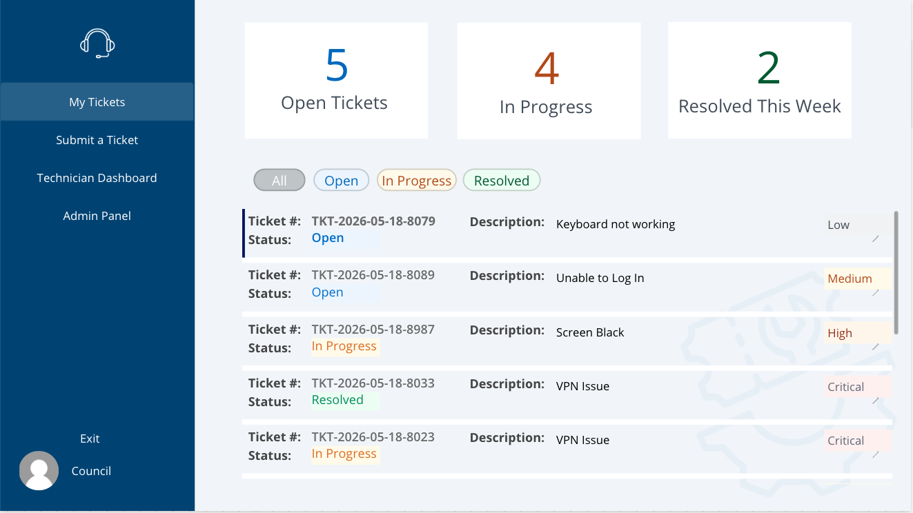
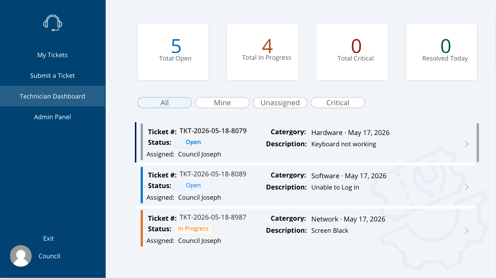
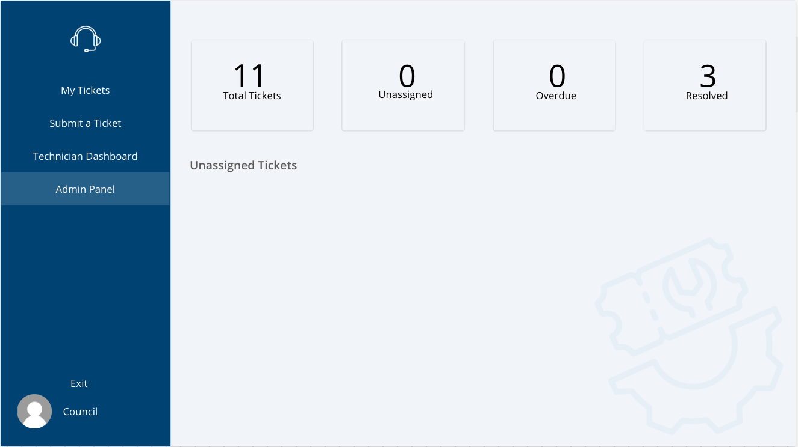

# IT Helpdesk Ticket Tracker — Power Apps + SharePoint + Power Automate

## Overview

A canvas app built in Microsoft Power Apps that allows staff to submit and track IT support tickets, technicians to manage and resolve their assigned workload, and admins to oversee the full ticket queue. The app is backed by SharePoint as the data source and Power Automate for automated notifications.

---

## Use Case

In organizations without a dedicated helpdesk platform, IT requests often come in through email, Teams messages, or verbal asks — making them hard to track, prioritize, and resolve consistently. This app centralizes all IT support requests in one place, giving staff visibility into their tickets, technicians a structured queue, and admins oversight across the full operation.

---

## App Structure

The app uses a **side navigation bar** for screen-to-screen movement and consists of the following screens:

| Screen | Description |
|--------|-------------|
| Welcome Screen | Landing page with app title and signed-in user — no data, clean entry point |
| Home Dashboard | Summary cards showing open, in progress, and resolved ticket counts |
| Submit Ticket | Form for staff to log a new IT request |
| My Tickets | Gallery of the logged-in user's tickets with open ticket count and filter by status |
| Ticket Detail | Full ticket view with status update and resolution notes for technicians |
| Technician Dashboard | Full ticket queue with filters for All, Mine, Unassigned, and Critical |
| Admin Panel | Unassigned ticket queue, technician roster, and ticket assignment panel |

---

## Role Based Access

Access to screens and controls is dynamically controlled based on whether the logged-in user exists in the IT Technicians SharePoint list:

| Role | Access |
|------|--------|
| Staff | Submit tickets, view own tickets only |
| Technician | View and update all assigned tickets, access Technician Dashboard |
| Admin | Full access including assignment panel and Admin Screen |

---

## Flow Summary

### Power Automate Flows

**Flow 1 — New Ticket Notification**
- Trigger: New item created in Tickets list
- Posts Adaptive Card to IT Teams channel with ticket details
- Sends email to IT support inbox

**Flow 2 — Status Update & Assignment Notification**
- Trigger: Item modified in Tickets list
- If technician assigned → sends email to technician with assignment details
- If status changed → sends email to requester with updated status and resolution notes

**Flow 3 — Overdue Ticket Alert**
- Trigger: Scheduled daily
- Queries tickets open longer than 3 days
- Sends summary email to admin listing all overdue tickets

---

## SharePoint Lists

**IT Helpdesk Tickets**
| Column | Type |
|--------|------|
| Title (Ticket Number) | Single line of text |
| RequestedBy | Single line of text |
| RequesterEmail | Single line of text |
| Category | Choice (Hardware, Software, Network, Access, Other) |
| Priority | Choice (Low, Medium, High, Critical) |
| Description | Multiple lines of text |
| Status | Choice (Open, In Progress, On Hold, Resolved, Closed) |
| AssignedTo | Single line of text |
| TechnicianEmail | Single line of text |
| ResolvedDate | Date |
| ResolutionNotes | Multiple lines of text |

**IT Technicians**
| Column | Type |
|--------|------|
| Title (Technician Name) | Single line of text |
| TechnicianEmail | Single line of text |
| Specialization | Choice (Hardware, Software, Network, Access, Admin) |
| IsAvailable | Yes/No |

---

## Key Formulas & Expressions

| Formula | Purpose |
|---------|---------|
| `"TKT-" & Text(Today(), "yyyy-mm-dd") & "-" & Text(CountRows('IT Helpdesk Tickets') + 1, "0000")` | Generates unique sequential ticket number on submission |
| `!IsEmpty(Filter('IT Technicians', TechnicianEmail = User().Email))` | Controls visibility of technician-only screens and controls |
| `CountIf('IT Helpdesk Tickets', Status.Value = "Open" && ResolvedDate >= DateAdd(Today(), -7, Days))` | Counts resolved tickets for dashboard summary cards |
| `first(body('Get_items')?['value'])?['ColumnName']` | Extracts single value from SharePoint Get Items without triggering a For Each loop |

---

## Status & Priority Color Scheme
<!-- 
**Status Colors**
| Status | Fill | Text |
|--------|------|------|
| Open | #EFF6FF | #1A73C8 |
| In Progress | #FFFBEB | #B45309 |
| On Hold | #F3F4F6 | #4B5563 |
| Resolved | #F0FDF4 | #166534 |
| Closed | #F1EFE8 | #444441 |

**Priority Colors**
| Priority | Fill | Text |
|----------|------|------|
| Critical | #FEF2F2 | #991B1B |
| High | #FFF7ED | #9A3412 |
| Medium | #FFFBEB | #B45309 |
| Low | #F3F4F6 | #4B5563 |
-->
---

## Common Errors & Fixes

**Error:** Choice column formulas not working

**Cause:** Choice columns in SharePoint return an object, not plain text. Referencing them directly without `.Value` will return blank or an error.

**Fix:** Always append `.Value` when referencing Choice columns in Power Apps:
```
Status.Value = "Open"
ThisItem.Priority.Value
{Value: ddCategory.Selected.Value}
```

---

**Error:** Set Variable action gets wrapped in a For Each loop

**Cause:** Power Automate sees Get Items results as an array and automatically wraps downstream actions in a loop.

**Fix:** Use `first()` in the Expression tab to extract a single value without triggering a loop:
```
first(body('Get_items')?['value'])?['ColumnName']
```

---

**Error:** Navigate() and Set() throwing "Name is Invalid" inside a component

**Cause:** Power Apps components cannot directly call Navigate() or reference global variables without custom properties configured.

**Fix:** Either add custom output properties to the component, or copy nav bar elements directly onto each screen instead of using a component.

---

## Notes

- The app uses a **side navigation bar** with role-based icon visibility — technician and admin icons are hidden from regular staff
- Filters on My Tickets and Technician Dashboard reset to **All** automatically when returning to the Home screen
- ResolvedDate is set automatically when a technician changes status to Resolved — no manual date input required
- The Ticket Number is auto-generated by Power Apps on submission using today's date and a sequential row count — no manual entry needed

---

## Technologies Used

- Microsoft Power Apps (Canvas App)
- Microsoft SharePoint Online
- Microsoft Power Automate
- Microsoft Teams (Adaptive Cards)
- Outlook / Exchange Online
- Microsoft 365

---

## Screenshots
### Welcome Screen


### Submit Ticket Screen


### My Tickets Screen


### Technician Dashboard


### Admin Panel


### Teams Adaptive Card Notification
